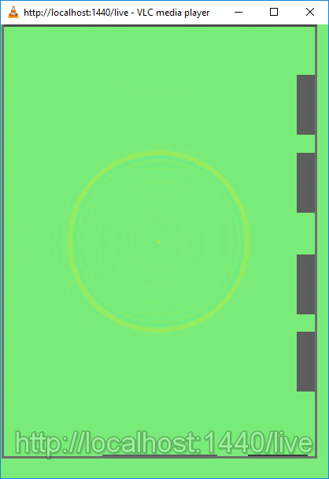
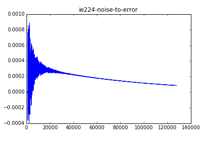
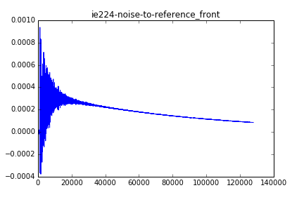
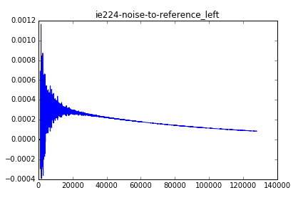
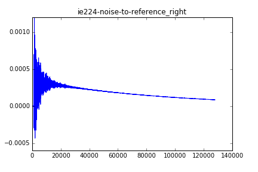
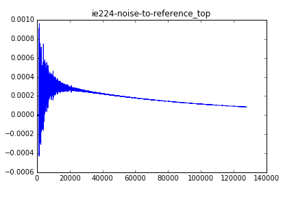
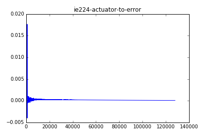
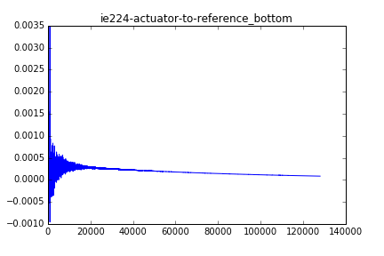
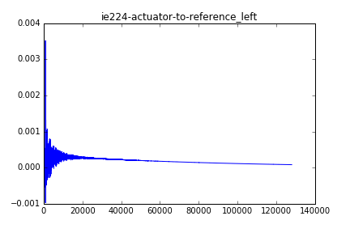

The `.dat` files and images referenced by this report are generated by the `ie224-impulse.py` simulation. If the dependencies are met (Anaconda and VLC media player) opening the simulation file and hitting `F5` should generate those files.

The field simulation was run for 4 seconds at 32 kHz with a 2 kHz upper cutoff frequency.

The simulation calculates impulse responses in the room IE 224 modeled by the files in `models/ie224`. It describes the paths for a one-error, six-reference, one-actuator ANC system in a room with a single noise source.

The paths are calculated with the impulse method. A bandlimited impulse is emitted from each sound source and the pressure function is recorded at each microphone. See the comments in the simulation file for more specifics.

The impulse responses are saved into the `ie224-noise-to-*.dat` and `ie224-actuator-to-*.dat` files. These can be loaded into the Matlab program `impulse-anc-matlab` for executing the ANC simulations.

Below are the plots of the impulse responses. You may notice that they have a significant very low frequency component that shifts the impulse response away from the zero line. I have been told it's something like the "room gets blown up". This low frequency component eventually disappears, and it doesn't bother the ANC simulation so it doesn't bother me.

