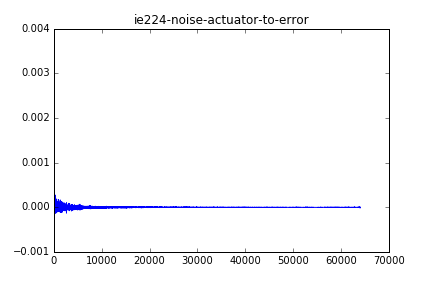

The `.dat` files and images referenced by this report are generated by the `ie224-noise.py` simulation. If the dependencies are met (Anaconda and VLC media player) opening the simulation file and hitting `F5` should generate those files.

The field simulation was run for 10 seconds at 32 kHz with a 2 kHz upper cutoff frequency.

The simulation calculates impulse responses in the room IE 224 modeled by the files in `models/ie224`. It describes the paths for a one-error, six-reference, one-actuator ANC system in a room with a single noise source.

The paths are calculated with white noise method. A bandlimited white noise is emitted from each sound source and the pressure function is recorded at each microphone. Then the LMS algorithm is used to determine the impulse response described by the input (`x`) and outputs (`y_noise` and `y_actuator`) See the comments in the simulation file for more specifics.

Running the field simulation took about 10 minutes on a GTX 1070. **Note** that running the `EstimateIr` function to get the impulse responses takes hours, during which the script gives no feedback whatsoever. If you deleted the previously generated `.dat` files from this directory, you can see the fresh results appear one by one after about an hour.

The impulse responses are saved into the `noise-to-*.dat` and `actuator-to-*.dat` files. These can be loaded into the Matlab program `impulse-anc-matlab` for executing the ANC simulations.

Below are the plots of the impulse responses.

